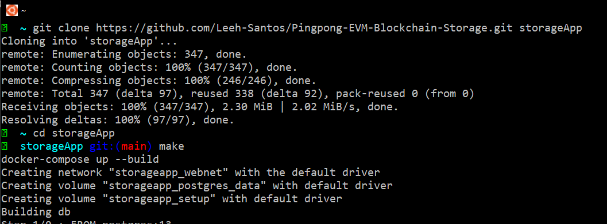
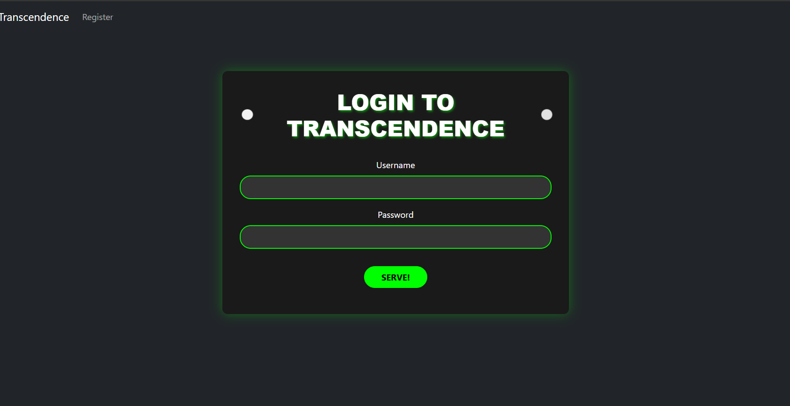
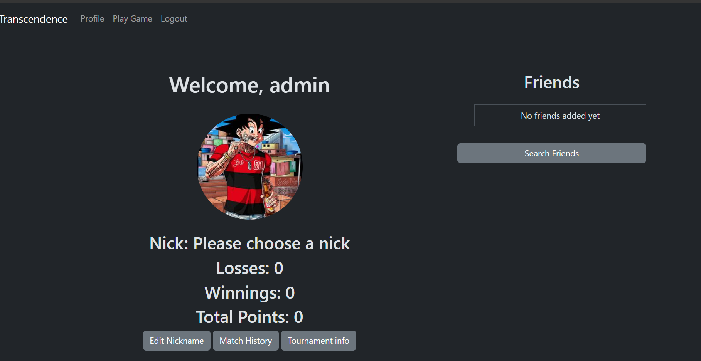
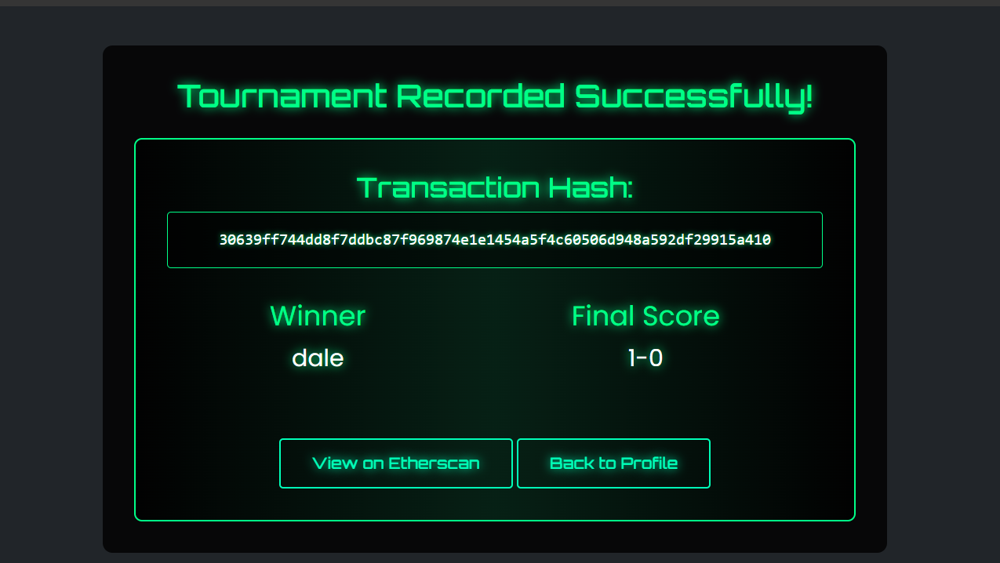
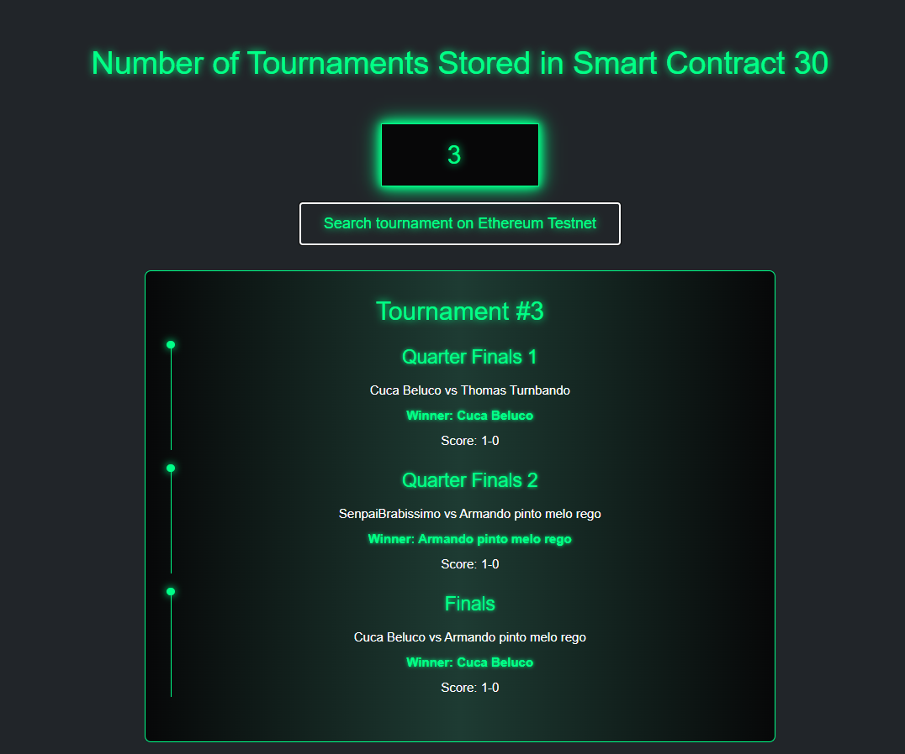

# Pingpong Tournament Score stored at EVM Blockchain - ft_Trancensence Project

SPA Web app with django API's, with local pingpong tournament game, capable of storing and retrieving tournament matches from EVM Blockchains, currently on Sepolia TestNet.

Project Arquitecture: We are using docker-compose to run a little network, with 4 containers

- Nginx Container for certificates since we are using https
- A Django container for REST API
- A Postgres container for Database
- A Vault container for an extra layer of security

For more info Check the docker-compose.yml file

Requirements: You will need Docker and Docker-Compose previously installed in order to run it.

Run it: git clone this repo, cd into it and then use make to trigger the "docker-compose up --build" command of the Makefile



Once all containers are built and the network is running, you can access the app locally thru https://localhost:1443/

The warning: Unknown Unstrusted Personal Certificate will pop up, don't worry, you can proceed since we are using a self-sign certificate for SSL/TLS, the browser is just noticing you.

At the Login page you can either Signin or use the admin user defined in .env previously -> username: admin pass: admin123

<table>
  <tr>
    <td></td>
    <td></td>
  </tr>
</table>

APP STRUCTURE Resume:

- The Django API is located at pingping/autentication/views.py for the Backend
- For the Frontend SPA a Router was used in order to render the page-element and its script according to the url or app navegation. Located at static/js/router.js and the scripts for the page-elements and API calls are located at static/js/views directory.

Since the main focus of this repo is to show the EVM integration, without further or do lets dive in!

According to the Major selected on the [42 Project subject](en.subject.pdf), the website needed to handle the usual user authentication and be capable of storing and retrieving info from the PingPong Tournaments, So it was necessary to apply a web2 + web3 logic.

In fully web3 apps, your wallet is your authentication, but since we are already using our API to authenticate users, the solution was to have a server wallet address that would interact with the already deployed smart-contract on sepolia. Here is how it works:

First I deployed this [Smart-contract](tournament-pica.sol) with Remix IDE, it has a structure to store the Tournament PingPong matches, each match will have the nick of the players, the winner and the score, which will be saved in a Tournamet array. The contract is also capable of retreiving the number of Tournaments played, and the Tournament's full information by index.


<div align="center">
  <h2>⚠️ DISCLAIMER ⚠️ **SECURITY WARNING**</h2>
</div>

The .env file was uploaded just for demonstration purposes. 
<div style="; color: white; padding: 15px; border-radius: 5px; margin: 10px 0;">
<strong>NEVER EVER PUT YOUR PRIVATE KEYS IN A .ENV FILE AND LEAVE IT UNENCRYPTED, IN FACT ANY KIND OF PRIVATE KEY IN PLAIN TEXT IS DANGEROUS.</strong>
</div>

There are many solutions out there, like a vault, using forge store keys...

A [file](pingpong/authentication/web3_settings.py) was added due to necessary blockchain setup interaction for the API, this sets contract abi(a JSON that defines the interface of a smart contract to interact with) and some variables from the [.env](.env) that will be needed in order interact with the Sepolia testnet, such as the already deployed smart-contract address, the infura Id, and the server wallet's privite and public keys.

Once the "Play Game" and "Tournament" options are selected the tournament will run and will gather the information in this struct located at the [Tournament script](pingpong/static/js/views/Tourhistory.js) so it can be sent to the [Backend Djano API](pingpong/authentication/views.py). 
```
var tournamentMatch = {
    date: new Date().toISOString(),
    quarter1: {p1: "",p2: "",w: "",  score: ""},
    quarter2: {p1: "",p2: "",w: "" , score: ""},
    finals: {p1: "",p2: "",w: "" ,score:""}
};
```
The Django view function that will handle it is [def endTour(request)](pingpong/authentication/views.py#L400-L444), that will:

1 - Get the Nonce:


```
nonce = web3_settings.w3.eth.get_transaction_count(web3_settings.WALLET_ADDRESS)
```
- Each transaction must have a unique nonce to prevent double-spending, Without it, transactions would be rejected by the network

2 - Build the Transaction and sign:

```
transaction = web3_settings.contract.functions.addTournament(
    date,
    quarter1_data,
    quarter2_data,
    finals_data
).build_transaction({
    'from': web3_settings.WALLET_ADDRESS,
    'nonce': nonce,
    'gas': 3000000,
    'gasPrice': web3_settings.w3.eth.gas_price,
    'chainId': 11155111
})

signed = web3_settings.w3.eth.account.sign_transaction(
    transaction,
    private_key=web3_settings.WALLET_PRIVATE_KEY
)
```
- This creates an unsigned transaction object with all necessary parameters
- Signs the transaction with your private key
- This proves you authorize this transaction
- Without signing, the network would reject the transaction

3 - Send the Transaction:

```
tx_hash = web3_settings.w3.eth.send_raw_transaction(signed.raw_transaction)
```
- Broadcasts the signed transaction to the Ethereum network
- Returns a transaction hash that can be used to track the transaction

4 - Wait for Confirmation:
```
tx_receipt = web3_settings.w3.eth.wait_for_transaction_receipt(tx_hash):
```

- Waits for the transaction to be mined and included in a block
- Returns a receipt with details about the transaction execution
- Important for knowing if the transaction was successful or failed

Once is backend finishes the transaction, it returns the transaction hash, so you can verify at sepolia.etherscan later



Now in order to check the Tournaments history stored at EVM testnet, select "Tournament info" within the profile page, the "Match History" option is for other game modes.

Here we simple pass the parameter with the tournament index that you want to look for to our Backend API: [def getTournament(request)](pingpong/authentication/views.py#L476-L530), that will call the function from the smart-contract returning the specific Tournament information.
```
    function getTournament(uint256 index) public view returns (
        string memory date,
        string[4] memory quarter1Data,
        string[4] memory quarter2Data,
        string[4] memory finalsData
    ) 
```




